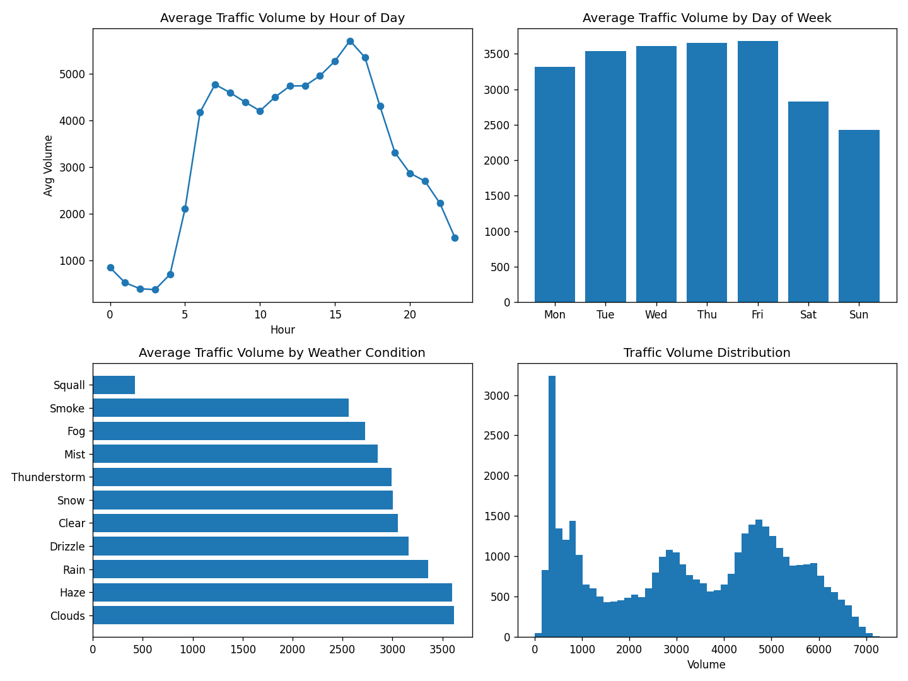
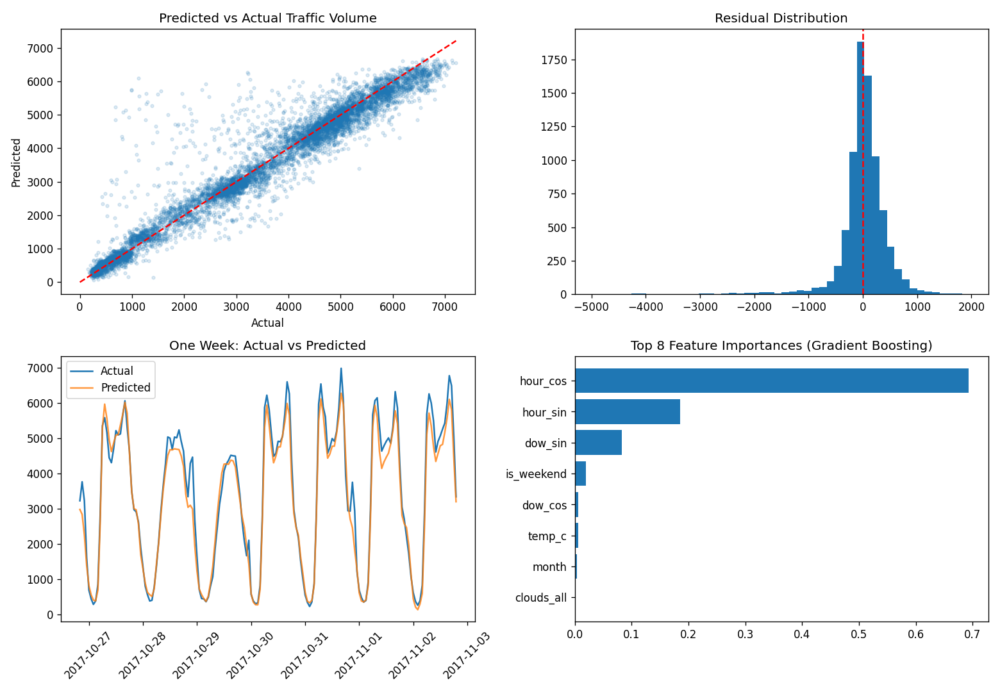
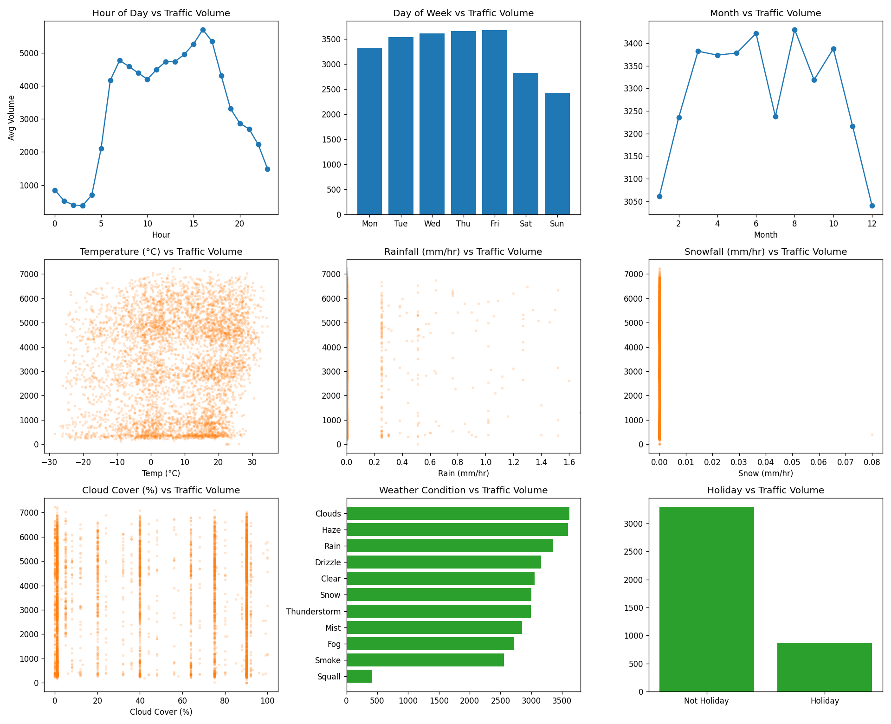

# Traffic flow prediction

[](https://www.python.org/)
[](https://fastapi.tiangolo.com/)
[](https://streamlit.io/)
[](https://github.com/Hydrosamueldc/Traffic-Flow-Predictor-/actions/workflows/python-app.yml)

A machine-learning traffic-volume prediction project inspired by my undergraduate thesis on the Lighthill-Whitham-Richards (LWR) traffic-flow model.

The thesis studied traffic from a numerical and physics-based angle: given an initial traffic density profile, how does traffic evolve along a road? This project studies the same traffic-flow problem from a data-driven angle: given time, weather, holiday information, and recent traffic history, what traffic volume should we expect?

## Project summary

This project predicts hourly traffic volume on the I-94 westbound highway corridor using historical traffic and weather data. It includes:

- a trained machine-learning model saved with Joblib
- a FastAPI prediction backend
- a Streamlit dashboard with an animated traffic preview
- rough prediction intervals from the Random Forest tree spread
- model evaluation outputs and plots
- API tests
- Docker support

The current model predicts a point estimate such as:

```text
Predicted traffic volume: 3094.9 vehicles/hour
Likely range: 2850.0 to 3300.0 vehicles/hour
```

## Why this project exists

My undergraduate thesis used the LWR partial differential equation to simulate traffic density waves using Upwind and Lax-Wendroff finite difference schemes. That work was mathematical and simulation-based.

This project is a companion project. Instead of solving a PDE, it learns from real-world historical data.

| Thesis project | This ML project |
|---|---|
| Physics-based traffic simulation | Data-driven traffic prediction |
| Uses LWR PDE and finite difference schemes | Uses scikit-learn models |
| Simulates density over road position and time | Predicts hourly traffic volume |
| Needs initial and boundary conditions | Needs time, weather, holiday, and lag features |
| Explains how congestion waves move | Forecasts expected traffic demand |

A strong future version would combine both: the ML model could estimate expected demand, then an LWR numerical model could simulate how congestion spreads along a road.

## Dataset

Source: UCI Machine Learning Repository, Metro Interstate Traffic Volume dataset.

The raw data contains hourly I-94 westbound traffic volume and weather observations from October 2012 to September 2018.

Main target:

```text
traffic_volume = number of vehicles passing the sensor in one hour
```

## Features used

The model uses:

- hour of day
- day of week
- month
- weekend flag
- holiday flag
- temperature
- rain
- snow
- cloud cover
- weather category
- traffic volume 1 hour ago
- traffic volume 3 hours ago
- traffic volume 24 hours ago
- rolling 3-hour traffic average

The lag features are important because traffic is highly related to recent traffic conditions.

## Data preparation

The project cleans the original dataset by:

- removing duplicate timestamp rows
- removing impossible temperature readings of 0 Kelvin
- converting the sparse holiday column into a binary holiday flag
- converting temperature from Kelvin to Celsius
- encoding hour and day of week cyclically
- one-hot encoding weather categories
- adding lag and rolling traffic features

Final cleaned dataset size: 40,565 hourly records.

## Modeling results

The data is split chronologically, not randomly, so the model is tested on future records relative to the training period.

| Model | MAE | RMSE | R2 |
|---|---:|---:|---:|
| Linear Regression | 370.2 | 495.6 | 0.937 |
| Random Forest | 149.9 | 243.5 | 0.985 |
| Gradient Boosting | 196.8 | 299.2 | 0.977 |

The Random Forest model is saved as the best model.

## Results and visualizations

### Traffic patterns in the dataset

Traffic is lowest overnight, rises sharply during the morning commute, and reaches its highest average level during the afternoon rush period. Weekday traffic is also noticeably higher than weekend traffic.



### Model evaluation

The predicted-versus-actual plot shows how closely predictions follow measured traffic. The one-week comparison shows the model following the repeated daily traffic cycle, while the residual chart shows the remaining prediction errors.



### Input variables compared with traffic volume

These plots show how time, weather, cloud cover, and holidays relate to the number of vehicles recorded per hour. They help explain which patterns are available to the model before training.



The PNG files are committed to the repository, so GitHub displays them directly without running Python. To regenerate them locally or in GitHub Codespaces, run:

```bash
python scripts/02_eda.py
python scripts/04_evaluate_and_plot.py
python scripts/05_variable_vs_target_plots.py
```

## Stack

| Tool | Purpose |
|---|---|
| Python | Main programming language |
| pandas | Table/data cleaning, similar to Excel in Python |
| NumPy | Numerical calculations |
| scikit-learn | Machine-learning models |
| Matplotlib | Charts and plots |
| Joblib | Saves and loads the trained model |
| FastAPI | Prediction API backend |
| Uvicorn | Runs the FastAPI server |
| Streamlit | Interactive dashboard |
| Requests | Lets the dashboard call the API |
| Pytest | Automated tests |
| Docker | Optional containerized deployment |

## Repository structure

```text
traffic-flow-ml/
  app/
    dashboard.py          Streamlit dashboard
    predict_api.py        FastAPI prediction service
  data/
    metro_traffic_raw.csv Raw data
    traffic_clean.csv     Cleaned data
  figures/
    eda_overview.png
    model_evaluation.png
    variable_vs_target.png
  models/
    best_model.pkl
    feature_columns.pkl
    metrics.json
    feature_importances.csv
  scripts/
    01_clean_and_feature_engineer.py
    02_eda.py
    03_train_models.py
    04_evaluate_and_plot.py
    05_variable_vs_target_plots.py
  tests/
    test_api.py
  Dockerfile
  requirements.txt
  pytest.ini
  README.md
```

## How to run locally on Windows

Clone the repository and enter the project folder:

```powershell
git clone https://github.com/Hydrosamueldc/Traffic-Flow-Predictor-.git
cd Traffic-Flow-Predictor-
```

Create a Python 3.11 virtual environment and install the dependencies:

```powershell
py -3.11 -m venv .venv
.\.venv\Scripts\Activate.ps1
python -m pip install --upgrade pip
python -m pip install -r requirements.txt
```

Start the API in terminal 1:

```powershell
python -m uvicorn app.predict_api:app --host 127.0.0.1 --port 8000 --reload
```

Leave terminal 1 running. Open another terminal, go to the same folder, and start the dashboard:

```powershell
cd Traffic-Flow-Predictor-
.\.venv\Scripts\Activate.ps1
python -m streamlit run app/dashboard.py
```

The dashboard should open in your browser.

You can also start both with one command:

```powershell
.\start_project.ps1
```

For a slower beginner walkthrough, see [run.md](run.md).

## Configuration

The dashboard reads the API URL from the `TRAFFIC_API_URL` environment variable.

For local use, copy the example file:

```powershell
Copy-Item .env.example .env
```

Default value:

```text
TRAFFIC_API_URL=http://127.0.0.1:8000
```

## API examples

Health check:

```bash
curl http://127.0.0.1:8000/health
```

Single prediction:

```bash
curl -X POST http://127.0.0.1:8000/predict \
  -H "Content-Type: application/json" \
  -d '{
    "hour": 17,
    "day_of_week": 2,
    "month": 10,
    "temp_c": 15.0,
    "rain_1h": 0.1,
    "snow_1h": 0.0,
    "clouds_all": 40,
    "is_holiday": 0,
    "weather_main": "Clouds",
    "traffic_volume_lag_1h": 3200,
    "traffic_volume_lag_3h": 3100,
    "traffic_volume_lag_24h": 3000,
    "rolling_3h_mean": 3150
  }'
```

Batch prediction:

```bash
curl -X POST http://127.0.0.1:8000/batch-predict \
  -H "Content-Type: application/json" \
  -d '{"items":[{"hour":17,"day_of_week":2,"weather_main":"Clouds"},{"hour":3,"day_of_week":6,"weather_main":"Snow"}]}'
```

Model metadata:

```bash
curl http://127.0.0.1:8000/metadata
```

These examples are safe to keep in the README because they use local demo data and do not expose passwords, tokens, API keys, or private customer information.

## Docker

Build the image:

```bash
docker build -t traffic-flow-ml .
```

Run the API container:

```bash
docker run -p 8000:8000 traffic-flow-ml
```

The Dockerfile runs the FastAPI backend. Render builds this container using the included `render.yaml` configuration.

## Tests

Run:

```powershell
python -m pytest -q
```

The tests check that:

- feature rows include the expected lag features
- the prediction endpoint returns a valid prediction
- the prediction endpoint returns an interval estimate
- the metadata endpoint works
- batch prediction returns multiple predictions

## Current limitations

- The model is trained on one highway corridor, so it should not be treated as a universal traffic predictor.
- The dataset ends in 2018, so production use would require retraining with current data.
- The prediction interval is an approximate range from Random Forest tree variation, not a statistically calibrated guarantee.
- The dashboard animation is a visual traffic-intensity preview, not a physical traffic simulation.
- The public API does not include authentication, rate limiting, or production monitoring.
- The free Render service may take about a minute to wake after inactivity.

## Future improvements

- Calibrate the prediction interval against real forecasting errors.
- Add authentication and rate limiting for public deployment.
- Add monitoring and scheduled retraining.
- Validate the model on another road corridor.
- Add an LWR numerical simulation module from the undergraduate thesis.
- Build a hybrid workflow where ML predicts demand and the LWR model simulates congestion propagation.

## Deployment

The project uses two hosted services:

| Component | Platform | Purpose |
|---|---|---|
| Dashboard | Streamlit Community Cloud | Displays the interactive prediction interface |
| Prediction API | Render | Loads the trained model and returns predictions |

Backend health check: [traffic-flow-predictor-njqc.onrender.com/health](https://traffic-flow-predictor-njqc.onrender.com/health)

The dashboard stores the backend address in its Streamlit Cloud secrets:

```toml
TRAFFIC_API_URL = "https://traffic-flow-predictor-njqc.onrender.com"
```

The free Render service sleeps after inactivity. The first prediction may therefore take up to a minute while the service wakes; later predictions should be faster.

## Thesis connection in one sentence

This project extends my undergraduate interest in traffic-flow modeling from a numerical PDE approach into a practical machine-learning prediction system using real traffic data.
